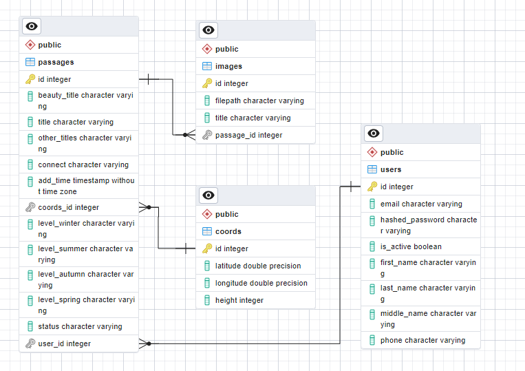

# upgraded-journey

API is set up for use with Docker.\
Provides two versions:

- /v1: one endpoint for all data
- /v2: separate endpoints

Build: `docker-compose up -d --build`

Run tests: `docker-compose exec web pytest --cov --cov-report=html`

### Features:
* Async FastAPI endpoints
* Alembic migrations
* Async SQLAlchemy connection using asyncpg for main DB connection and aiosqlite for testing. 
* OAuth2 + JWT authentication

### ERD

